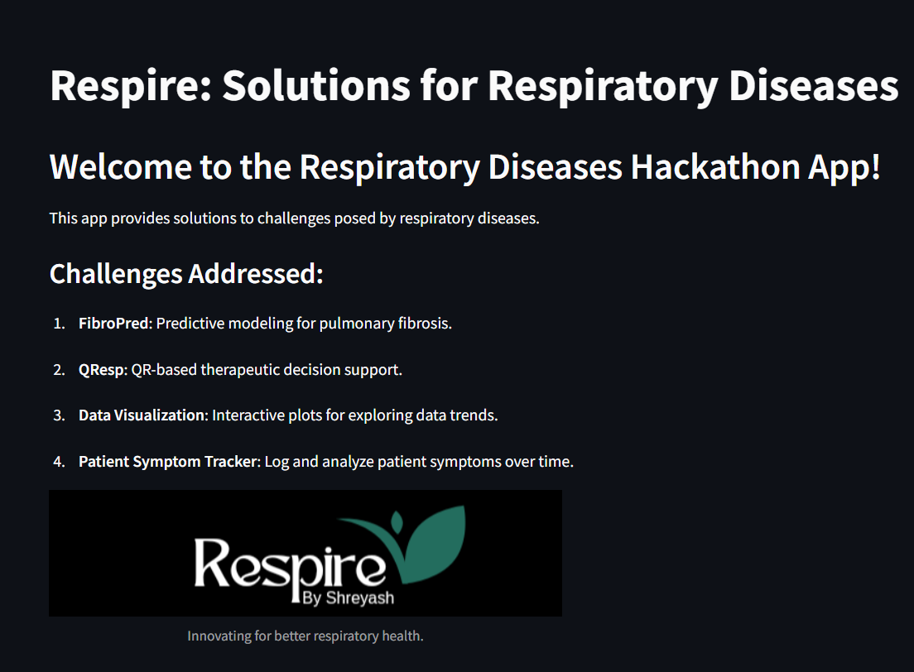
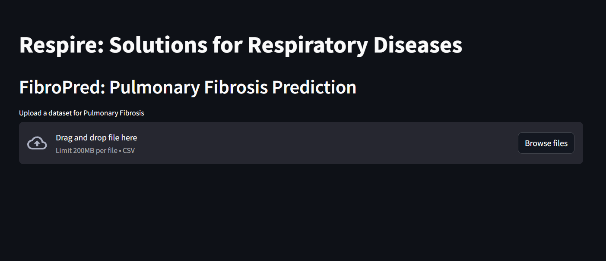

# Respiratory Diseases Solutions App

This Streamlit application is designed to provide innovative solutions to challenges related to respiratory diseases. It was developed as part of a hackathon initiative to tackle issues in respiratory health using technology.

[](https://youtu.be/YV0klYNzNmU)

## Features

1. **FibroPred: Pulmonary Fibrosis Prediction**
   - Upload datasets to predict pulmonary fibrosis outcomes.
   - Select features and target columns for predictive modeling.
   - Evaluate the model using accuracy, precision, recall, and F1 score.
   - Visualize feature importance using interactive charts.

2. **QResp: QR Therapeutic Decision Tool**
   - Enter patient details such as age, symptoms, and medical history.
   - Generate QR codes containing patient information to aid in therapeutic decision-making.

3. **Data Visualization**
   - Upload datasets for analysis.
   - Generate correlation heatmaps to explore relationships between variables.
   - Create scatter plots to analyze data trends.

4. **Patient Symptom Tracker**
   - Log patient symptoms and medical details over time.
   - Save logs to a CSV file for record-keeping.
   - View and analyze logged data within the app.

## Installation

1. Clone this repository:
   ```bash
   git clone https://github.com/shreyazh/Respire
   cd respiratory-diseases-app
   ```

2. Install required dependencies:
   ```bash
   pip install -r requirements.txt
   ```

3. Run the app:
   ```bash
   streamlit run app.py
   ```

## Requirements

- Python 3.7+
- Streamlit
- Pandas
- NumPy
- scikit-learn
- Matplotlib
- Seaborn
- qrcode
- Pillow

Install all dependencies using:
```bash
pip install -r requirements.txt
```

## Usage

1. Start the app using `streamlit run app.py`.
2. Navigate through the sidebar to access different modules:
   - **Home**: Overview of the application and challenges.
   - **FibroPred**: Train and evaluate predictive models for pulmonary fibrosis.
   - **QResp**: Generate QR codes for patient data.
   - **Data Visualization**: Explore datasets using heatmaps and scatter plots.
   - **Patient Symptom Tracker**: Log and view patient symptoms over time.

## Screenshots

### Home Page


### FibroPred


### Data Visualization


## Contributing

We welcome contributions! Please follow these steps:
1. Fork the repository.
2. Create a new branch (`feature/your-feature-name`).
3. Commit your changes.
4. Push the branch and submit a pull request.

## License

This project is licensed under the MIT License. See the `LICENSE` file for details.

## Acknowledgments

This project was developed for the Respiratory Diseases Hackathon. Special thanks to the organizers and contributors for their support and collaboration.

